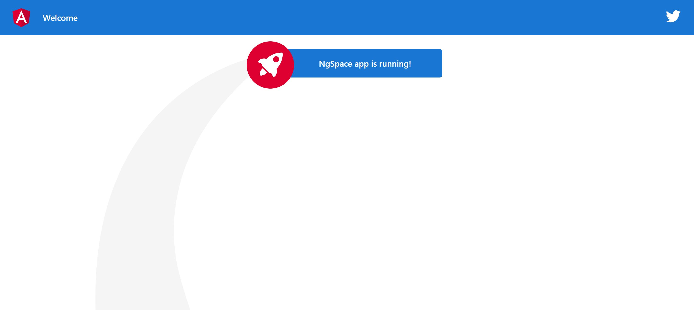

# NgSpace

Champion, your company is looking for a hero to work on its bleeding edge frontend application. This is no easy task, which is why we setup this quest for you to prepare yourself for the journey. Follow the todo list and keep an eye on the helpful links if you want to succeed.

## Todos

1. Create a new Angular application called `ngSpace` with the following requirements:

* Use `scss` style files
* Use `ngs` as a prefix for all the generated selectors
* Has no routing module     

2. Start the application locally and open it in the browser

3. Cleanup all html except for the Toolbar and Highlight Card

4. The style tag in a component template is a bad practise, find a better place and don't forget to remove the unused classes

5. There is a typo in the card title, it should be `NgSpace` instead of `ngSpace`

6. Be careful, the tests are now failing ! Fix them quick xD

## Further help

- https://angular.io/cli/new
- https://angular.io/cli/serve
- https://angular.io/guide/component-styles#component-styles
- https://angular.io/guide/template-syntax#interpolation-
- https://angular.io/cli/test

## Expected results:

