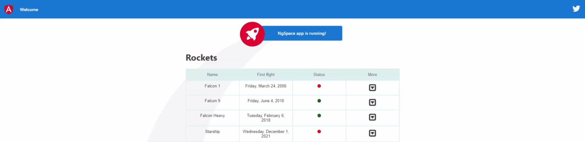

# NgSpace

Champion, your company is looking for a hero to work on its bleeding edge frontend application. This is no easy task, which is why we setup this quest for you to prepare yourself for the journey. Follow the todo list and keep an eye on the helpful links if you want to succeed.

## Todos

1. Create a new Angular component called `RocketsList` with the following requirements:

* Use `rockets-list.component.{ts|html|scss}` as filenames
* Use `ngs-rockets-list` as a selector
* Do not generate a test file

2. Use the `RocketsList` component in the `App` component template

3. Our backend is not ready yet, use the code snippet below to quickly generate a mocked rockets list in the `RocketsList` component

4. Display the list of rockets on the view using the template and styles snippets below

5. Add font-awesome's library to the project and use the circle icon in order to better display the (in)active status of the rockets 

6. Our backend is finally ready, fetch the information from this endpoint `https://api.spacexdata.com/v3/rockets`. It will be helful to create a model called `Rocket` to help with typechecking the received data.

7. Your colleague suggested using HttpClient directly in the component is not a good practise, how about creating a `RocketsService` to encapsulate the fetching logic ?

8. With great code comes great tests, it's time to write some for the `RocketsList` component:

* Should create RocketsListComponent when all dependencies are available.
* Should create 3 rows when total fetched rockets is 3
* Should use active class when rocket is active
* Should use inactive class when rocket is inactive

9. It seems that AppComponent tests are failing, investigate why and fix it using a single line !
10. Guy from the actuary department doesn't like how the first flight date is displayed, he prefers it in **fullDate** format *`(e.g. Friday, March 24, 2006 instead of 2006-03-24)`*

11. Someone from the marketing department thinks it will be a good idea to display more rocket details on demand:
* Create a new component `RocketDetailsComponent` using the snippets below
* Use the `RocketDetailsComponent` in the `RocketsListComponent`
* Add a *More* column to the rockets table using the code snippets below
* Make sure that every click on the More row cells triggers a `displayDetails` method to save the selected `rocket_id` value 
* Pass in the selected `payload_weights` value from the `RocketsListComponent` to the `RocketDetailsComponent` via an Input named `payloads`

12. Oh no, the tests are failing again ! Fix them quick xD

13. Bonus: Display `RocketDetailsComponent` using the `slidein` animation from the `custom.animations.ts` file

## Further help

- https://angular.io/cli/generate
- https://angular.io/api/common/NgForOf
- https://github.com/angular/angular-cli/blob/master/docs/documentation/stories/include-font-awesome.md
- https://fontawesome.com/v4.7.0/icon/circle
- https://angular.io/api/common/NgClass
- https://documenter.getpostman.com/view/2025350/RWaEzAiG?version=latest
- http://www.json2ts.com/
- https://angular.io/guide/http#setup
- https://www.learnrxjs.io/
- Install a mocking library like [sinon](https://sinonjs.org/) : `npm install -D sinon @types/sinon`.
- [How to stub methods `sinon.stub(object, "method")`](https://sinonjs.org/releases/latest/stubs/)
- https://www.npmjs.com/package/ng-mocks
- https://angular.io/api/common/DatePipe
- https://angular.io/api/common/CommonModule
- https://angular.io/guide/user-input#binding-to-user-input-events
- https://tburleson-layouts-demos.firebaseapp.com/#/docs
- https://angular.io/guide/component-interaction#pass-data-from-parent-to-child-with-input-binding
- https://angular.io/guide/animations

## Expected results:



## Resources:

```typescript
  rockets = [
    {
      id: 1,
      active: false,
      company: 'SpaceX',
      rocket_name: 'Falcon 1',
      first_flight: '2006-03-24'
    },
    {
      id: 2,
      active: true,
      company: 'SpaceX',
      rocket_name: 'Falcon 9',
      first_flight: '2010-06-04'
    },
    {
      id: 3,
      active: true,
      company: 'SpaceX',
      rocket_name: 'Falcon Heavy',
      first_flight: '2018-02-06'
    }
  ];
```

```html
<div class="items-container">
  <h1>Rockets</h1>
  <div class="items-header">
    <div class="hcell">Name</div>
    <div class="hcell">First flight</div>
    <div class="hcell">Status</div>
  </div>
 <!-- TODO 4: Use the right directive to iterate through the list of rockets and display the name, first flight date and active status of each rocket-->
  <div class="item-row">
    <div class="rcell"></div>
    <div class="rcell"></div>
     <!-- TODO 5: Use the (in)active classes in combination with circle icon to display the rocket status-->
    <div class="rcell"></div>
  </div>
</div>
```

```css
:host {
  display: flex;
  flex-flow: column;
  align-items: center;
  .items-container {
    font: normal 13px Arial, sans-serif;
    .items-header {
      display: flex;
      .hcell {
        background-color: #ddefef;
        border: solid 1px #ddeeee;
        color: #336b6b;
        padding: 10px;
        text-align: center;
        text-shadow: 1px 1px 1px #fff;
        width: 150px;
      }
    }
    .item-row {
      display: flex;
      .rcell {
        border: solid 1px #ddeeee;
        color: #333;
        padding: 10px;
        text-shadow: 1px 1px 1px #fff;
        width: 150px;
        text-align: center;
        .active {
          color: green;
        }
        .inactive {
          color: red;
        }
      }
    }
  }
}
```

```html
<!-- RocketDetailsComponent HTML -->
<div class="row" *ngFor="let payload of payloads">
  <div class="label-value-container">Name: {{ payload.name }}</div>
  <div class="label-value-container">Kg: {{ payload.kg }}</div>
</div>
```

```css
/*  RocketDetailsComponent SCSS */
:host {
  /* TODO 12: hmm, something vertically is missing here ! */  
  background-color: lightgray;
  .row {
    /* TODO 12: something is missing here ! */  
    min-width: 100%;
  }
  .label-value-container {
    /* TODO 12: Split me up ? */
  }
}
```

```html
<!-- More header cell -->
<div class="hcell">More</div>
<!-- More row cell -->
<div class="rcell fa fa-caret-square-o-down fa-2x"></div>
```
